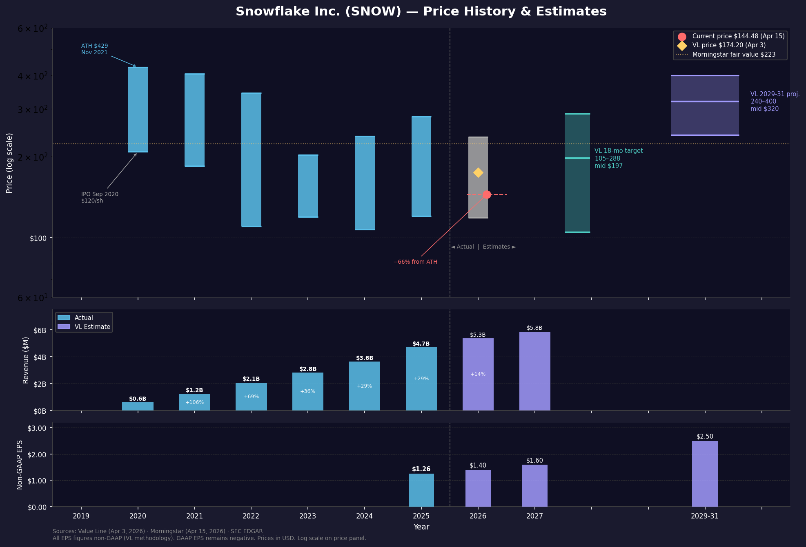

# Snowflake Inc. (SNOW) — Equity Analysis
**Date:** 2026-04-16

> **Price note:** Value Line price as of April 3, 2026: **$174.20**. Morningstar last close as of April 15, 2026: **$144.48** (reflecting a further ~17% decline over 12 days). All value metrics below use **$144.48** as the current price, which is more actionable for today's decision. Where the score would differ at $174.20, it is noted.

---

## Data Sources
| Source | Available |
|--------|-----------|
| Value Line PDF | Yes (April 3, 2026) |
| Morningstar PDF | Yes (April 15, 2026) |
| SEC Edgar (live) | Yes (10-K filed 2026-03-20; 8-K 2026-03-31) |

---

## Company Overview
Snowflake Inc. operates the AI Data Cloud, a multi-cloud platform that allows organizations to consolidate, share, and analyze data across public cloud environments in a unified, governed framework. Founded in 2012 and headquartered in Bozeman, Montana, the company serves more than 13,300 customers globally — including hundreds of Fortune 2000 companies in financial services, media, retail, and the public sector. Snowflake competes in data warehousing, data lakes, and increasingly in AI/ML application workloads via its Data Cloud ecosystem.

---

## Price History & Estimates

*Three-panel chart generated from Value Line, Morningstar, and SEC Edgar data. Top: Annual high/low price bars (log scale) with current price, Morningstar fair value, and Value Line target zones. Middle: Revenue actuals and estimates. Bottom: Non-GAAP EPS actuals and estimates. Dashed vertical line separates actual from estimated data. GAAP EPS remains deeply negative and is not charted.*

---

## Scorecard

> **GAAP vs. Non-GAAP note:** Value Line switched to non-GAAP reporting for SNOW beginning with FY2025. Morningstar reports GAAP throughout. This creates a significant divergence — the GAAP/non-GAAP EPS gap is approximately $2.60/share, almost entirely explained by stock-based compensation (SBC). Where both figures are relevant, both are noted. Scoring follows Value Line's non-GAAP framework except where GAAP data is clearly more informative (e.g., moat assessment, GAAP profitability timeline).

---

### Growth (14/20)

| Metric | Value | Score |
|--------|-------|-------|
| Revenue Growth (8q) | 25.8% / 31.8% / 28.8% / 30.1% (FY2025 q-by-q YoY); 32.9% / 28.9% / 28.3% / 27.4% (FY2024 q-by-q YoY) | **5** |
| EPS Growth (8q) | Non-GAAP FY2025: $0.24 / $0.35 / $0.35 / $0.32; FY2026E: $0.32 / $0.35 / $0.38 / $0.35; YoY growth ~11% | **3** |
| Cash Flow/Share Growth | FY2022: $0.08 / FY2023: $0.11 / FY2024: -$3.03 / FY2025: $2.00 / FY2026E: $2.00 | **3** |
| Projected EPS Growth (2–3 yrs) | FY2025 $1.26 → FY2027E $1.60 = ~13% CAGR; VL 2029-31E $2.50 = ~14% CAGR from FY2025 | **3** |

#### Revenue Growth (8q) — Score: 5
Snowflake's top-line performance is the unambiguous strength of this investment thesis. Over the trailing eight quarters (FY2024 Q1 through FY2025 Q4), revenue grew between 25.8% and 32.9% year-over-year in every single quarter:

| Quarter | Revenue | YoY Growth |
|---------|---------|-----------|
| FY2024 Q1 (Apr 2023) | $828.7M | +32.9% |
| FY2024 Q2 (Jul 2023) | $868.8M | +28.9% |
| FY2024 Q3 (Oct 2023) | $942.1M | +28.3% |
| FY2024 Q4 (Jan 2024) | $986.8M | +27.4% |
| FY2025 Q1 (Apr 2024) | $1,042.1M | +25.8% |
| FY2025 Q2 (Jul 2024) | $1,145.0M | +31.8% |
| FY2025 Q3 (Oct 2024) | $1,212.9M | +28.8% |
| FY2025 Q4 (Jan 2025) | $1,284.0M | +30.1% |

Full-year revenues: FY2023 $2,807M → FY2024 $3,626M (+29%) → FY2025 $4,684M (+29%). This is a company compounding at ~29% annually at a $4.7B revenue base — a rare accomplishment in enterprise software. Revenue growth actually re-accelerated slightly in FY2025 vs. FY2024, allaying concerns about deceleration. Forward guidance calls for ~14% growth in FY2026 ($5.35B) and ~9% in FY2027 ($5.85B), implying meaningful deceleration ahead, but the trailing 8-quarter record is unimpeachable. **Score 5 — >20% YoY, consistent across all 8 quarters.**

#### EPS Growth (8q) — Score: 3
This metric requires careful interpretation due to the GAAP/non-GAAP split. On a **GAAP** basis, Snowflake lost money throughout all 8 quarters — and losses actually deepened from FY2023 (-$2.55/sh total) to FY2024 (-$3.86/sh total), largely driven by accelerating stock-based compensation. On a **non-GAAP** basis (which Value Line now uses), Snowflake turned profitable in FY2025:

| Period | GAAP EPS | Non-GAAP EPS |
|--------|----------|--------------|
| FY2024 (full year) | -$3.86 | n/a (VL didn't report non-GAAP) |
| FY2025 Q1 | -$1.29 | $0.24 |
| FY2025 Q2 | -$0.89 | $0.35 |
| FY2025 Q3 | -$0.87 | $0.35 |
| FY2025 Q4 | -$0.90 | $0.32 |
| FY2025 (full year) | ~-$3.95 | $1.26 |
| FY2026E (full year) | n/a | $1.40 |

The GAAP/non-GAAP gap of ~$2.60/share is almost entirely stock-based compensation — a real economic cost paid in shareholder dilution. The non-GAAP EPS of $1.26 in FY2025 growing to an estimated $1.40 in FY2026 represents only ~11% year-over-year growth, well below the >20% threshold for a Score 5. The trajectory is clearly positive — from deep losses toward profitability — but the growth rate on the non-GAAP line is modest, and the GAAP picture remains deeply negative with no near-term path to GAAP profitability. **Score 3 — improving but not consistently >20% growth; single non-GAAP metric with only two data points of positive history.**

#### Cash Flow/Share Growth — Score: 3
Free cash flow is a better measure of Snowflake's economic progress than GAAP earnings, as it strips out non-cash items while retaining SBC (unlike non-GAAP). Snowflake has made real FCF progress:

| Year | FCF (Morningstar) | FCF/Share (VL) | Op. Cash Flow (SEC) |
|------|-------------------|----------------|---------------------|
| FY2022 | $348M | $0.08/sh | n/a |
| FY2023 | $631M | $0.11/sh | n/a |
| FY2024 | $793M | n/a | ~$874M |
| FY2025 | $769M | $2.00/sh | ~$1,222M (FY2026 from SEC) |
| FY2026E | n/a | $2.00/sh | n/a |

The VL "Cash Flow/Share" figure includes D&A, and shows a dramatic swing from -$3.03/sh in FY2024 to +$2.00/sh in FY2025 — reflecting the first year of meaningful non-GAAP operating leverage. However, the FY2026 estimate holds flat at $2.00/sh, suggesting margin improvement has plateaued in the near term. Morningstar's FCF figures show $769M in FY2025 after a slight dip from FY2024's $793M; SEC operating cash flow for FY ending January 2026 came in at $1.22B, a significant step up. The FCF yield at current prices (~$49.7B market cap / ~$1.1B FCF) is approximately 2.2%, thin for a company with no moat. **Score 3 — turned positive, solid improvement, but flat guidance for FY2026 and still low FCF yield.**

#### Projected EPS Growth (2–3 yrs) — Score: 3
Value Line projects non-GAAP EPS growing from $1.26 (FY2025) to $1.40 (FY2026E) to $1.60 (FY2027E), representing a ~13% CAGR over two years. Looking out to the 2029-31 projection window, VL estimates $2.50/sh — a ~14% CAGR from FY2025 over approximately 6 years. Morningstar's PEG ratio of 4.0, with a Forward P/E of ~80x at the time of their report, implies a long-term EPS growth estimate of about 20% embedded in consensus. The rubric threshold for Score 5 is >15% CAGR; for Score 3, it's 7–10%. At 13–14%, Snowflake is between these bands — closer to the Score 5 threshold but not reaching it, partly because the absolute EPS base ($1.26) is still modest relative to the market cap (~$49.7B). **Score 3 — growth is real but below the >15% threshold; the high SBC burden structurally limits non-GAAP EPS acceleration.**

---

### Fundamentals (12/20)

| Metric | Value | Score |
|--------|-------|-------|
| Operating Margin Trend | Non-GAAP: 9.9% (FY2025 net) → VL shows 15.5% op. margin; rising to 16.0%/16.5% (FY2026E/FY2027E); GAAP: -30.6% | **3** |
| ROE Trend | Non-GAAP: 24.2% FY2025 → declining to 19.0% FY2026E/FY2027E; GAAP: -54.1% | **3** |
| Debt Level | LT Debt $2,280M; est. non-GAAP EBITDA ~$946M → ~2.4x; declining to ~$1,000M by 2029-31E | **3** |
| Share Count Trend | 323.3M (FY2022) → 334.5M (FY2023) → 333.9M (FY2024) → 343.9M (FY2025) → 346.0M (FY2027E) | **3** |

> All scores in this category use Value Line's non-GAAP framework. On a pure GAAP basis, operating margin (-30.6%), ROE (-54.1%), and net margin (-28.4%) would all score 1. The GAAP/non-GAAP gap represents approximately $2.60/share in annual SBC — roughly $900M/year in dilutive compensation that non-GAAP accounting treats as invisible.

#### Operating Margin Trend — Score: 3
Value Line reports non-GAAP operating margins as follows:

| Year | Non-GAAP Op. Margin | GAAP Op. Margin (Morningstar) |
|------|---------------------|-------------------------------|
| FY2022 | NMF | ~-55.8% |
| FY2023 | NMF | ~-38.6% |
| FY2024 | NMF | ~-29.8% |
| FY2025 | ~15.5% | -30.6% |
| FY2026E | 16.0% | n/a |
| FY2027E | 16.5% | n/a |
| 2029-31E | 16.5% | n/a |

The non-GAAP story is one of improving operating leverage — VL notes that "healthier operating margins thanks to leadership's cost-conscious approach" are supporting their near-term outlook. On a GAAP basis, however, Snowflake spent 42% of revenue on R&D alone in FY2025 (Morningstar), and total GAAP operating losses ran -$1,435M against $4,684M in revenue. The non-GAAP margin of 15.5% is real in the sense that cash operating costs are well-controlled, but it excludes the SBC drag that makes GAAP losses so large. Importantly, the projected improvement from 15.5% to 16.5% over two years is modest — this is not a business pivoting rapidly to high margins. The rubric awards Score 5 for rising margins above 20%; Snowflake sits comfortably in the "Stable 10–15%" band with a gentle positive slope. **Score 3.**

#### ROE Trend — Score: 3
Value Line calculates non-GAAP ROE of 24.2% for FY2025, based on non-GAAP net income of approximately $466M against shareholder equity of $1,924M. This is optically strong — above the >15% threshold for a Score 5. However, two factors cap the score:

1. **Declining trend:** VL projects ROE falling to 19.0% in both FY2026E and FY2027E, before recovering to ~23.5% by 2029-31. The near-term direction is downward, which disqualifies a Score 5 (requires ">15% and rising").
2. **GAAP reality check:** On a GAAP basis, Morningstar shows ROE of -54.1% (TTM) — deeply negative, as GAAP net losses of ~$1.33B are divided by shrinking equity of $1.92B. The gap between 24.2% (non-GAAP VL) and -54.1% (GAAP Morningstar) is entirely SBC.

The declining non-GAAP ROE trend reflects rising equity (as the balance sheet strengthens) growing faster than near-term earnings. **Score 3 — above 15% on non-GAAP basis but falling; GAAP ROE remains sharply negative.**

#### Debt Level — Score: 3
Snowflake carries $2,279.8M in long-term debt (as of January 31, 2026, per Value Line and SEC filings). To assess the debt burden:

- Non-GAAP operating income: ~15.5% × $4,684M revenue = ~$726M
- Add back D&A ($220M) → non-GAAP EBITDA ≈ **$946M**
- **Debt/EBITDA ≈ 2.4x** — above the Score 3 threshold of 1–2x, but below the Score 1 threshold of >3x

The critical mitigant is the trajectory: Value Line projects LT debt declining from $2,280M today to $1,850M (FY2026E) → $1,350M (FY2027E) → $1,000M (2029-31E). Meanwhile, cash on the balance sheet is substantial at $2,828M (SEC, FY ended Jan 2026), meaning Snowflake is **net cash positive** — total cash ($2,828M) exceeds LT debt ($2,280M) by ~$548M. Financial leverage (total assets / equity = $9.1B / $1.9B = 4.7x, per Morningstar) remains elevated but is manageable given the FCF profile. The debt load is not a near-term risk; the trajectory is clearly toward deleveraging. **Score 3 — debt/EBITDA ~2.4x is above the "excellent" band but declining rapidly; net cash position provides buffer.**

#### Share Count Trend — Score: 3
Snowflake's share count has risen steadily due to stock-based compensation, partially offset by modest buyback activity:

| Year | Shares Outstanding |
|------|--------------------|
| FY2022 | 323.3M |
| FY2023 | 334.5M (+3.4%) |
| FY2024 | 333.9M (~flat) |
| FY2025 | 343.9M (+3.0%) |
| FY2026E | 345.0M (+0.3%) |
| FY2027E | 346.0M (+0.3%) |
| 2029-31E | ~350.0M |

The rate of dilution appears to be slowing — from +3% annually in FY2023/FY2025 to a projected +0.3% annually in FY2026-27. S-8 registration (new employee equity grants) filed March 2026 confirms ongoing SBC issuance. There are no buybacks. Morningstar's R&D/Revenue ratio of 42% (far above the software industry average of ~15%) signals that a large portion of the SBC is loaded into R&D headcount compensation — heavy but strategically defensible for a company in growth mode. The dilution is real but slowing, and the near-flat trajectory from FY2026 forward is closer to "stable" than "rising quickly." **Score 3 — dilution is occurring but decelerating; no buyback program offsets this.**

---

### Value (8/20)

| Metric | Value | Score |
|--------|-------|-------|
| PEG Ratio | 4.0 (Morningstar) | **1** |
| Relative P/E (vs. S&P 500) | Non-GAAP fwd P/E ~103x ($144.48 ÷ $1.40E) ÷ S&P 500 trailing ~26x = **4.0x** | **1** |
| P/FCF | Market cap ~$49.7B ÷ FCF ~$1.12B = ~44x (Morningstar: 43.6x) | **1** |
| Price vs. Value Line 18-mo Target | $144.48 vs. $197 midpoint ($105–$288 range) = **36% below midpoint** | **5** |

> **S&P 500 trailing P/E used:** ~26x (multpl.com / gurufocus, mid-April 2026; range across sources: 25.1–27.2x).

#### PEG Ratio — Score: 1
Morningstar reports a PEG ratio of **4.0**, one of the most expensive readings possible for this metric. PEG is calculated as Forward P/E ÷ long-term EPS growth rate. Morningstar's Forward P/E at their last close of $144.48 was 80.6x. Back-solving: 80.6 / 4.0 = **~20% implied long-term EPS growth rate** embedded in consensus estimates. Even accepting that 20% long-term EPS growth is achievable (optimistic given the ~13% CAGR in VL's model), a PEG of 4.0 means you are paying 4x the growth rate for each dollar of earnings. For context, a PEG of 1.0 is considered fair value (paying the same multiple as the growth rate); 2.0 is expensive; 4.0 is in speculative territory. At VL's price of $174.20, using VL's FY2026E EPS of $1.40 and a ~13% growth estimate, the PEG would be ($174.20 / $1.40) / 13 = 124.4 / 13 = **~9.6** — even more extreme. By any PEG measure, SNOW is deeply overvalued relative to its earnings growth. **Score 1 — well above the 2.0 threshold.**

#### Relative P/E vs. S&P 500 — Score: 1
The rubric measures SNOW's P/E as a multiple of the broad market:

- **SNOW non-GAAP forward P/E:** $144.48 ÷ $1.40 (VL FY2026E) = **103x**
- **S&P 500 trailing P/E:** ~26x (April 2026)
- **Relative P/E:** 103 ÷ 26 = **4.0x the market**

Using Morningstar's Forward P/E of 80.6x (which uses consensus EPS estimates, likely higher than VL's $1.40): 80.6 ÷ 26 = **3.1x the market** — still deeply above the 1.5x threshold for Score 1.

For context on how extreme this is: a stock trading at a 4x market premium needs to grow earnings roughly 4x faster than the S&P 500 for an equivalent return. The S&P 500 long-term EPS growth is typically ~7–8%, implying SNOW needs ~28–32% EPS growth annually — approximately double what VL projects. Even bulls using a 20% EPS CAGR would need to accept SNOW at 3x+ the market multiple. **Score 1 — P/E premium to market is extreme by any benchmark.**

#### P/FCF — Score: 1
Free cash flow is arguably the most honest profitability metric for Snowflake, as it avoids the GAAP/non-GAAP SBC debate (SBC is a real cash cost in the form of dilution, but FCF captures actual cash generation). Data points:

| Source | FCF | Market Cap | P/FCF |
|--------|-----|------------|-------|
| Morningstar (TTM) | $1,117M | ~$49.7B | **43.6x** |
| SEC op. CF ($1,222M) - capex ($105M) | ~$1,117M | ~$49.7B | **~44x** |
| VL FY2025 CF/sh ($2.00 × 343.9M shares) | ~$688M | ~$49.7B | **~72x** |

The Morningstar and SEC figures converge around $1.1B in TTM FCF and a P/FCF of ~44x. Even this generous measure puts SNOW at nearly 3x the rubric's "expensive" threshold of >30x. FCF yield is approximately 2.2% ($1.1B / $49.7B) — less than a 10-year Treasury note. For a business with no economic moat and significant competitive threats, this FCF yield offers no margin of safety. The Morningstar 5-year average P/FCF of 1,391.7x reflects years when FCF was near zero; the recent improvement to 43.6x is dramatic progress but still prohibitive. **Score 1 — well above the >30x threshold.**

#### Price vs. Value Line 18-Month Target — Score: 5
Value Line's 18-month target price range for SNOW is **$105–$288**, with a midpoint of **$197**. This target is based on VL's methodology of applying 14.0× revenues per share to their FY2026-27 revenue estimates. At the current price of $144.48 (Morningstar, April 15):

- Distance to midpoint: ($197 − $144.48) / $144.48 = **36.4% below midpoint** → **Score 5**
- At VL's April 3 price of $174.20: ($197 − $174.20) / $174.20 = 13.1% below midpoint → would have been **Score 3**

The rapid deterioration from $174 to $144 over 12 days (a ~17% drop tied to broader macro turbulence and tariff concerns) meaningfully changes the score on this metric. The VL 2029-31 projections show a High target of $400 (+177% from $144) and a Low of $240 (+66%), implying significant long-term upside if the growth thesis plays out. This is the one value metric that has turned favorable — the selloff has created a price-to-target gap that meets the highest scoring threshold. **Score 5 — stock is ≥30% below VL's 18-month midpoint.**

---

### Quality & Moat (8/20)

| Metric | Value | Score |
|--------|-------|-------|
| Earnings Predictability | 65 (Value Line, 0–100 scale) | **3** |
| Price Stability | 15 (Value Line, 0–100 scale) | **1** |
| Financial Strength | B+ (Value Line) | **3** |
| Competitive Advantage | **None** (Morningstar Economic Moat) | **1** |

#### Earnings Predictability — Score: 3
Value Line assigns Snowflake an Earnings Predictability score of **65** (on a 0–100 scale where 100 = perfectly predictable). This score reflects the degree to which actual earnings have followed VL's estimates historically. A score of 65 is above average — reasonable for an enterprise SaaS business with multi-year consumption contracts — but it's constrained by several factors: the company's relatively short public history (IPO September 2020), the recent shift from GAAP to non-GAAP reporting, and the consumption-based revenue model (where customer data processing volumes can be lumpy and hard to predict). The rubric awards Score 5 for ≥80 and Score 3 for ~60; at 65, Snowflake sits comfortably in the 3 band. For context, highly predictable businesses like dominant consumer staples often score 90–100; the 65 score says Snowflake's results are moderately trackable but not dependable. **Score 3.**

#### Price Stability — Score: 1
Value Line assigns a Price Stability score of **15** (0–100 scale, 100 = most stable). This is among the lowest scores a large-cap stock can receive, reflecting the extraordinary volatility in SNOW's trading history:

| Period | Price Range | % Drawdown from High |
|--------|-------------|----------------------|
| All-time high (Nov 2021) | ~$429 | — |
| Low (May 2023) | ~$107 | -75% |
| Recovery high (Feb 2024) | ~$237 | — |
| Recent (Apr 2026) | ~$144 | -66% from all-time high |
| 52-week range | $118–$281 | — |

SNOW's Beta of 1.50 means the stock amplifies market moves by 50%. It has experienced two separate drawdowns exceeding 65% since its IPO. Morningstar rates its uncertainty as **"Very High"** — their second-highest uncertainty tier — consistent with a business where terminal value is highly sensitive to assumptions about AI adoption, competitive dynamics, and margin trajectory. The Price Growth Persistence score of 15 (also from VL) reinforces this — the stock has not demonstrated a reliable upward price trend. This score is a 1 by a wide margin. **Score 1 — Price Stability of 15 is well below the <40 threshold.**

#### Financial Strength — Score: 3
Value Line rates Snowflake's financial strength at **B+**, defined as a company with a solid but not exceptional balance sheet. Supporting data:

| Metric | Value | Assessment |
|--------|-------|------------|
| Cash & equivalents | $2,828M (SEC, Jan 2026) | Strong |
| Long-term debt | $2,280M | Meaningful but manageable |
| Net cash position | +$548M (cash > debt) | Positive |
| Current ratio | $5,743M current assets / $4,422M current liabilities = 1.3x | Adequate |
| LT interest expense | $50M/year on $2,280M debt | Low rate (~2.2%) |
| Working capital (VL) | $1,107M (FY2025) → rising to $2,500M (FY2026E) | Improving |

The B+ rating reflects Snowflake's comfortable cash position and low interest burden against its sizable debt load and ongoing GAAP losses. The company is not at risk of financial distress — it has sufficient liquidity to fund operations for several years. However, it is not an "A"-rated fortress balance sheet: GAAP stockholders' equity of $1,924M is being compressed by ongoing net losses, and financial leverage of 4.7x (total assets / equity) is elevated. Morningstar grades the financial health as **C**, more conservative than VL's B+, reflecting the ongoing GAAP losses and equity erosion. **Score 3 — solidly in the "B" band by VL's rating.**

#### Competitive Advantage — Score: 1
Morningstar assigns Snowflake an Economic Moat of **None** — meaning Morningstar's analysts do not believe the company earns returns on capital that are sustainably above its cost of capital. This is the most consequential single data point in the entire analysis. The moat framework evaluates:

- **Switching costs:** While migrating from Snowflake is disruptive, the emergence of the Apache Iceberg open table format (which Snowflake now supports) reduces proprietary lock-in. Data can increasingly be read by multiple engines without copying.
- **Network effects:** The Data Cloud marketplace has early network characteristics, but hyperscaler alternatives (AWS Data Exchange, Azure Marketplace) offer comparable ecosystems.
- **Cost advantages:** Snowflake's cloud-native architecture is efficient, but AWS Redshift, Google BigQuery, and Azure Synapse are backed by companies with structural cost advantages from their own infrastructure.
- **Intangible assets:** No patents or regulatory licenses creating durable barriers.

Value Line's analyst characterizes the competitive positioning more optimistically, highlighting partnerships and new product introductions. But Morningstar's "None" verdict is a significant red flag for a stock trading at 103x forward non-GAAP earnings. Without a moat, there is no reliable mechanism preventing margin compression as competitors mature. **Score 1 — No moat per Morningstar.**

---

### Risk & Catalysts (10/20)

| Metric | Value | Score |
|--------|-------|-------|
| Industry Timeliness | Middle quintile assumed (cloud/AI software; not explicitly ranked on this VL page) | **3** |
| Company Timeliness | Rank **5** (Lowest) — lowered from higher rank on 7/18/25 | **1** |
| Key Catalysts | Project SnowWork; NVIDIA/Amazon/Rockfish/Capita partnerships; AI data infrastructure demand; M&A optionality | **5** |
| Major Risks | No moat; extreme valuation; GAAP losses; CRO turnover; insider selling; macro/tariff headwinds; revenue deceleration | **1** |

#### Industry Timeliness — Score: 3
Value Line's industry timeliness ranking for the cloud/AI software sector is not explicitly displayed on this one-pager. Based on the broader technology landscape in April 2026 — with AI infrastructure spending robust but investor sentiment mixed due to macro uncertainty and tariff concerns — a middle-quintile ranking (Score 3) is the most defensible assumption. Cloud data platforms are neither the leading nor lagging sector in the VL universe at this time. **Score 3 — middle quintile assumed; data not explicit on this VL sheet.**

#### Company Timeliness — Score: 1
Value Line assigns Snowflake a Timeliness rank of **5** (Lowest, on a 1–5 scale). This rank was lowered on July 18, 2025 and most recently on April 3, 2026 the Technical rank was also lowered to 3. The Timeliness rank is VL's 12-month relative price performance forecast — a rank of 5 means VL expects SNOW to underperform the broad market averages over the next 12 months. This is a direct headwind for near-term investors. The VL analyst writes explicitly: "Snowflake shares remain ranked to underperform the year-ahead broader market averages (5: Lowest), and thus, probably won't appeal to short-term-minded accounts." The stock is down ~10% over 1 year and ~20.8% over 5 years (vs. the VL index +17.5% and +53.5%). The Technical rank of 3 (on the same 1–5 scale) indicates neutral near-term price momentum. **Score 1 — Timeliness rank 5 is the worst possible reading.**

#### Key Catalysts — Score: 5
Value Line and the March 2026 8-K identify multiple credible, near-to-medium-term catalysts:

1. **Project SnowWork** — Unveiled recently; an autonomous AI platform enabling enterprises to build agentic AI workflows using Snowflake data. Directly targets the AI application layer, which is the fastest-growing enterprise software category.
2. **NVIDIA partnership** — Integrates NVIDIA's GPU compute with Snowflake's Data Cloud for accelerated AI training and inference on proprietary data. Positions Snowflake at the intersection of data and AI compute.
3. **Amazon partnership** — Deep AWS integration (Snowflake runs natively on AWS) with expanded go-to-market collaboration.
4. **Rockfish Data & Capita partnerships** — Expanding industry-specific use cases in data analytics.
5. **FY2027 guidance reaffirmed** (March 31, 2026 8-K) — Management stood behind projections despite CRO transition and market volatility, signaling internal confidence.
6. **M&A optionality** — VL notes potential "bolt-on acquisition activity" as a growth lever; Snowflake has the balance sheet (net cash positive) to pursue targets.
7. **AI tailwind:** 13,300+ enterprise customers with massive proprietary datasets are precisely the organizations that need AI-ready data infrastructure. Every enterprise AI initiative is ultimately a data problem.

**Score 5 — multiple clear, credible catalysts with near-term revenue impact potential.**

#### Major Risks — Score: 1
The risk profile is significant and multi-dimensional:

1. **No economic moat** — As discussed above, Morningstar's "None" verdict means competitive advantages are not durable. Hyperscalers subsidize competing products to retain cloud spend.
2. **Extreme valuation with no cushion** — At 103x forward non-GAAP EPS and 44x FCF, any revenue miss or margin disappointment will cause severe multiple compression. The 2024–2026 period has already demonstrated this: the stock fell 66% from peak despite solid revenue growth.
3. **Revenue deceleration baked in** — Growth is guided to decelerate from ~29% (FY2025) to ~14% (FY2026E) to ~9% (FY2027E). Consumption-based models can decelerate faster than expected if enterprises tighten budgets or optimize workloads (a stated risk in the March 2026 8-K).
4. **GAAP profitability distant** — GAAP net losses of ~$1.33B in FY2025. SBC of ~$900M/year is structural. Path to GAAP profitability requires either significantly higher revenue scale or dramatic SBC reduction — neither is near-term.
5. **CRO departure (March 31, 2026)** — Chief Revenue Officer Mike Gannon left for "personal reasons" and was replaced by an internal promotion. CRO turnover is a yellow flag at a consumption-based revenue company where relationships and pipeline management are critical.
6. **Insider selling** — 174 Form 4 filings and multiple Form 144 planned sale notices in the past year. No identified open-market purchases. Form 144s filed as recently as April 2026 indicate ongoing selling pressure from insiders even as the stock trades near 5-year lows.
7. **Macro / tariff headwinds** — The March 2026 8-K explicitly names "tariffs and trade wars, extended federal government shutdowns, higher inflation" as risk factors. Enterprise IT budgets are sensitive to economic uncertainty; a slowdown in cloud spending would disproportionately impact Snowflake's consumption model.
8. **Open-source / Iceberg risk** — The adoption of Apache Iceberg as an open table format (which Snowflake now supports) commoditizes parts of the data warehouse layer, potentially reducing pricing power over time.

**Score 1 — risks are numerous, significant, and partially existential to the current valuation.**

---

## Total Score

| Category | Score | Max |
|----------|-------|-----|
| Growth | 14 | 20 |
| Fundamentals | 12 | 20 |
| Value | 8 | 20 |
| Quality & Moat | 8 | 20 |
| Risk & Catalysts | 10 | 20 |
| **TOTAL** | **52** | **100** |

**Verdict: AVOID**

---

## Key Findings

- **Revenue growth is outstanding** — SNOW has grown revenues >25% YoY for 8 consecutive quarters, a rare achievement at $4.7B scale. This is the primary investment merit.
- **Valuation is prohibitive.** At $144.48, the forward non-GAAP P/E is ~103x, P/FCF is ~44x, and PEG is 4.0. Even after a ~66% decline from peak, the stock is priced for flawless execution with no margin for error.
- **No economic moat.** Morningstar rates SNOW's competitive advantage as "None," meaning superior returns are not considered durable. The hyperscalers offer competing data warehouse/lakehouse solutions natively, making customer lock-in weaker than perceived.
- **GAAP profitability is distant.** Despite non-GAAP EPS of $1.26 in FY2025, GAAP net income was -$1.33B and operating income was -$1.44B. The divergence between GAAP and non-GAAP ($2.60+/share gap) reflects heavy stock-based compensation that is a real economic cost.
- **Insider activity is negative.** Multiple Form 144 filings (planned insider sales) in the past 90 days, combined with 174 Form 4 filings over the past year, indicate sustained insider selling pressure with no visible open-market buying.

---

## Bull Case
Snowflake's Data Cloud sits at the intersection of enterprise AI adoption and cloud infrastructure — two of the highest-conviction secular growth themes of the decade. With >13,300 enterprise customers, rising non-GAAP margins, and a clear AI platform strategy (Project SnowWork), the company could grow revenues from $5B+ to $8B+ by 2029-31 while crossing sustained GAAP profitability. For a patient investor with a 5+ year horizon, the recent selloff — from $429 to $144 — may represent structural overshoot, especially if Snowflake proves its AI monetization thesis.

## Bear Case
Snowflake faces existential competitive threats from hyperscalers who are rapidly improving native data/AI services at lower cost. The no-moat rating from Morningstar signals that differentiation may be narrowing, not widening. Meanwhile, the stock still trades at >100x non-GAAP earnings despite decelerating revenue growth (from 30%+ to guided 14–15% for FY2026), and GAAP losses remain enormous. With Value Line's Timeliness at 5 (Lowest) and ongoing insider selling, near-term price pressure is likely to persist. The stock could fall materially further if revenue growth disappoints or if the broader AI infrastructure spending cycle cools.

---

## Insider Activity
SEC Edgar shows 174 Form 4 filings and multiple Form 144s (Rule 144 planned sale notices) in the past 12 months. The volume of Form 144 filings clustered in March–April 2026 indicates multiple insiders are actively planning sales into the current market. No open-market purchases were identified. This is a net bearish signal. Value Line notes officers and directors own 6.8% of shares (Frank Slootman holds 3.3% of total outstanding).

---

## Recent Material Events
**8-K filed March 31, 2026 (accession 0001640147-26-000013):**
1. **CRO replacement:** Mike Gannon (Chief Revenue Officer) departed for personal reasons. Jonathan Beaulier, a 10-year Snowflake veteran most recently serving as GVP of U.S. Majors Sales, was promoted to CRO effective March 31, 2026. The internal promotion mitigates the abruptness of the departure, but CRO turnover at a consumption-based revenue company is a yellow flag.
2. **Guidance reaffirmed:** Snowflake simultaneously reaffirmed its Q1 and full-year FY2027 guidance (as originally issued on February 25, 2026 with Q4 FY2026 earnings). This is a modest positive — management felt confident enough to maintain guidance despite the CRO transition and market volatility.

---

## Sources
- Value Line Investment Survey — Snowflake Inc. (NYSE: SNOW), April 3, 2026
- Morningstar Investment Detail Report — SNOW, Release date April 15, 2026
- SEC EDGAR 10-K (FY ended January 31, 2026), filed March 20, 2026 — Accession 0001640147-26-000008
- SEC EDGAR 8-K, filed March 31, 2026 — Accession 0001640147-26-000013
- S&P 500 trailing P/E: multpl.com / gurufocus, ~26x as of mid-April 2026
